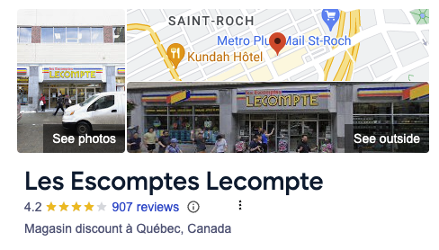
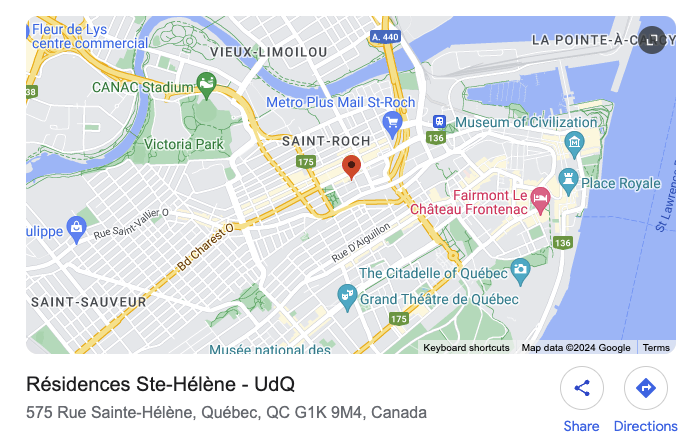
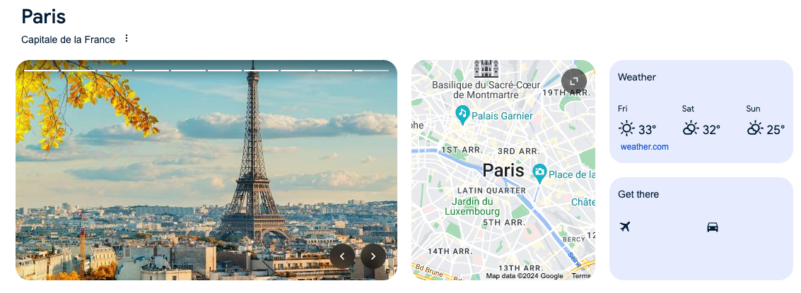

# Contributing

Feel free to create a Pull Request if you want to fix / enhance / etc this extension.

Please make sure it still works as expecting for the following scenarios (I will try to automate this part with tests) :

> [!TIP]
> You can easily test your changes by [loading the local unpacked extension on your browser](https://developer.chrome.com/docs/extensions/get-started/tutorial/hello-world#load-unpacked).

## Small map thumbnail

### Clickable map

1. Search for `Les Escomptes Lecompte quebec` in Google
2. You should see a small interactive map in the right side panel
3. Click on it
4. You should be redirected to the matching Google Maps page

### "Maps" tab

1. Search for `Les Escomptes Lecompte quebec` in Google
2. You should see a "Maps" tab
3. Click on it
4. You should be redirected to the matching Google Maps page

## Big map thumbnail

### Clickable map

1. Search for `575 Rue Sainte-Hélène quebec` in Google
2. You should see a big map thumbnail on the top of the page
3. Click on it
4. You should be redirected to the matching Google Maps page

### "Maps" tab

1. Search for `575 Rue Sainte-Hélène quebec` in Google
2. You should see a "Maps" tab
3. Click on it
4. You should be redirected to the matching Google Maps page

## Interactive 

### Clickable map

1. Search for `Paris` in Google
2. You should see a small interactive map in the middle of the "cards"
3. Click on it
4. You should be redirected to the matching Google Maps page

### "Maps" tab

1. Search for `Paris` in Google
2. You should see a "Maps" tab
3. Click on it
4. You should be redirected to the matching Google Maps page

